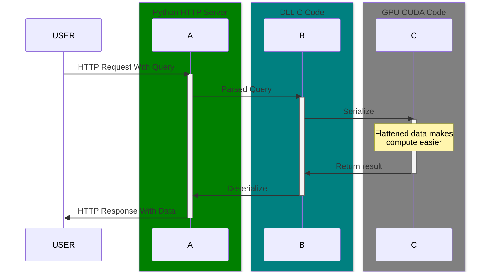

# lan2gpu
lan2gpu is a simple distributed computing library that aims to offload heavy numerical computation onto GPUs available in the local area network.

## Pre-Requisites
- C compiler (Visual Studio 2022, select Desktop Development with C++. Need the MSVC v143 build tools for C++ for x86/x64)
- NVIDIA GPU
- NVIDIA CUDA Compiler(this was made on CUDA 12.5)
- Python(this was made on Python 3.9. The latest Python should also work OK.)
- Flask(used for the server implementation)
- Make

## Installation

Clone the repository onto your local machine using git:

```bash
git clone https://github.com/Serpent03/lan2gpu.git
```

Before starting, build the DLL required using `make dll`, and run the project using `make run`.

## Overview

There are several files and folders of interest:
- `build/`: This is where the DLL(which includes CPU C, and GPU C code) is located once built.
- `lib/`: To compile successfully, the DLL needs the `cudart.lib`(CUDA runtime lib).
- `src/computation.c`: This is mainly where the C code for the CPU, and the exported functions and entry points are kept.
- `src/cudaimpl.cu`: This where the C code for the GPU is kept. A single "extern C" function marks the entry point for the C code for the CPU.
- `src/ipc.py`: This python file is what actually calls on the C code. 
- `server.py`: This file opens the server for HTTP/S requests.

## How does it work?

lan2gpu is an attempt at recreating a small scale distributed cloud computing platform: i.e, it takes data from the internet through a REST API(usually in the format of a 2D matrice) in JSON format, parses that data, and then calls on the C code intended to run on the CPU. In turn, that calls on the C code intended to run on the GPU, which finally does the calculations at a really fast pace, as compared to Python, or even normal C on the CPU.



## Future TODOs
- Async operations for multiple clients
- Distribute load from server to worker nodes
